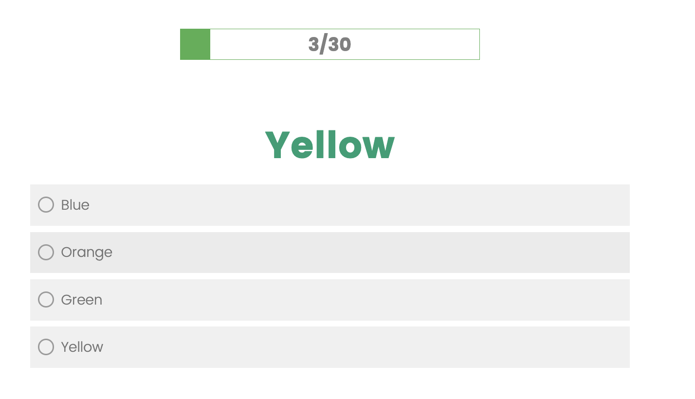
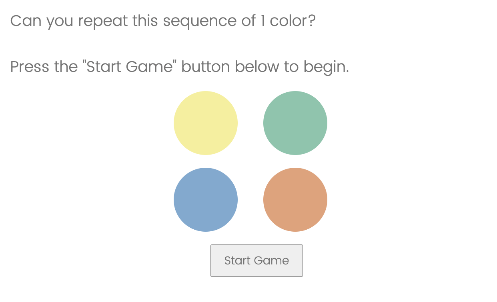

# qualtrics_code

### Stroop task
The file `stroop.qsf` contains a Qualtrics file for implementing the Stroop task. 
- There are 30 rounds
- Each round lasts 1.75 seconds
- There's a progress bar on top showing participants how far along they are
- Participants get feedback between rounds
    - If they get the color correct, they are shown "Correct" in between rounds
    - If they get it incorrect, they are shown "Incorrect"
    - If they don't answer in 1.75 seconds, they see "Time Out"

### Simon Says
The file `Simon_Says.qsf` contains a Qualtrics file for a "Simon Says" task (similar to that in [Carvalho et al., 2016](https://www.aeaweb.org/articles?id=10.1257/aer.20140481)).
- There are are two practice rounds where participants are told exactly which colors to press (no memory required)
- There are eight main rounds, with the number of colors to remember increasing by one each round
- In the first round, they have to remember one color, in the eighth round, they have to remember eight colors
- Participants do not get kicked out based on their responses

